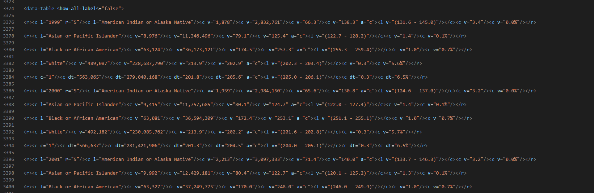

# CDC API Project

In this project we investigate cancer death data in the date range between 1999 and 2013, powered by the CDC's WONDER API. The API can be found here: (https://wonder.cdc.gov/). Requests to the API are written in xml, and guidance on the database identification parameters was difficult to find. Therefore, this data in particular was chosen to follow along with the example request and response given here: https://wonder.cdc.gov/wonder/help/WONDER-API.html ("1st Example Request").

### File Contents
The The document **cdc_wonder_api_requests.py** brings in the **req.xml** file and makes a request of the API per the structure of req.xml. The response is saved as **response.xml**. Responses are, of course, in xml format. The data is structured hierarchically: rows contain cells, which contain values. Some care is needed when parsing this into your language of choice. Year is contained right along with other values so that they don't get their own column if one is not careful. Additionally, every five rows contains a subtotal row. **xml_parser.py** does the work of parsing the response file. We intentionally discarded the subtotal rows to simplify the work of parsing, and pickled and saved the resulting dataframe as **my_df.pkl**

### The Data

The obtained table consists of eight columns, some of which are quite straightforward categorical or counted data, like race and year, and some of which are statistically derived, like standard error and confidence intervals. Consider the fact that census type data on the national level will necessarily be underrepresented. Some people fail to answer census questions, some people never have the opportunity to report census data, and so on. Recorded populations and deaths will probably be lower than the actual numbers, as it is impossible to perfectly count every single member of the United States's hundreds of millions of citizens. The recorded data therefore should be considered as a sample representitive of the true population, and appropriate statistical methods do apply.

The resulting table consists of the following columns:
- Race. Divided into four categories: American Indian or Alaskan Native, Asian or Pacific Islander, Black or African American, White.
- Number of Deaths: The amount of deaths in the year from any kind of cancer in the United States.
- Population: The population of that race in the United States.
- Crude Death Rate: total number of deaths of a row's particular race divided by the row's population multiplied by 100000. In our analysis we often divided these values by 1000 in order to get ordinary percentages.
- Age Adjusted Death Rate: From (https://wonder.cdc.gov/wonder/help/ucd.html#): "Age-adjusted death rates are weighted averages of the age-specific death rates, where the weights represent a fixed population by age. They are used to compare relative mortality risk among groups and over time. An age-adjusted rate represents the rate that would have existed had the age-specific rates of the particular year prevailed in a population whose age distribution was the same as that of the fixed population. Age-adjusted rates should be viewed as relative indexes rather than as direct or actual measures of mortality risk." Again, they are per 100000 as the crude death rate is. The age brackets, as well as more explanation on age adjusted death rates can be found in the above link.
- Confidence Interval: 95% confidence interval for crude death rates.
- Standard error for crude death rates. Expressed as a percentage.
- Year: the year in which the mortality measurements were taken.

With the technical hurdles of data acquisition overcome, we performed our exploration and analaysis in a series of jupyter notebooks.